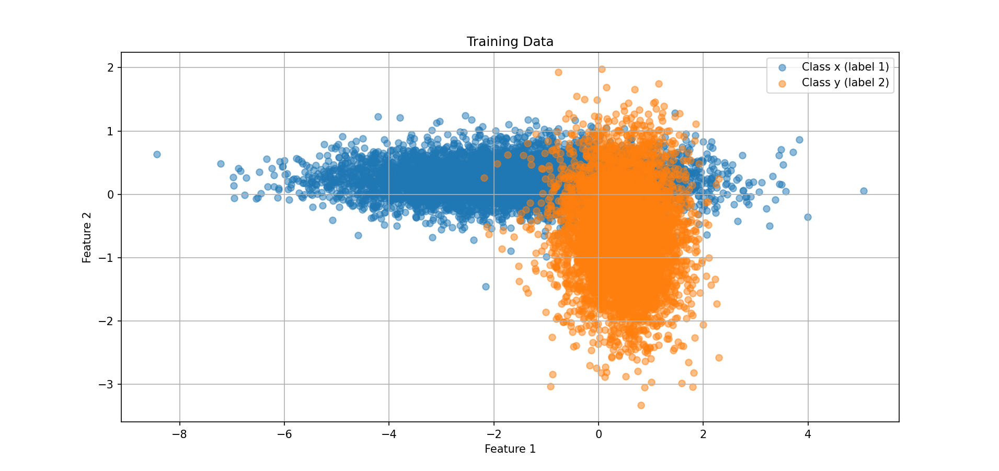

# Assignment 2 Bayesian, Parametric & Nonparametric

- Scatter Plot for training data.

### Exercise A
Classify instances in tst_xy, and use the corresponding label file tst_xy_class to calculate the accuracy;

- Accuracy: **90.92%**  
- Using priors estimated from the training set, the classifier achieves strong performance on the combined test set tst_xy.  
- This shows that the Gaussian model is able to capture the separation between classes *x* and *y* effectively.
 
### Exercise B
Classify instances in tst_xy_126 by assuming a uniform prior over the space of hypotheses, and use the corresponding label file tst_xy_126_class to calculate the accuracy;

- Accuracy: **88.82%**  
- Here, we assumed no prior knowledge about class frequencies and assigned equal prior probabilities (0.5 each).  
- The performance drops compared to (a), indicating that the true distribution of classes is not uniform.  
- This highlights the importance of incorporating prior information when class frequencies are imbalanced.

### Exercise C
Classify instances in tst_xy_126 by assuming a prior probability of 0.9 for Class x and 0.1 for Class y, and use the corresponding label file tst_xy_126_class to calculate the accuracy; compare the results with those of (b).

- Accuracy: **96.27%**  
- By setting priors closer to the true distribution (heavily favoring Class *x*), the classifier’s accuracy improves substantially.  
- This suggests that Class *x* dominates in the dataset, and leveraging this information reduces misclassifications.

**Improvement from (b) to (c)**  
  - Accuracy improved by **7.45%** when using the non-uniform prior compared to the uniform prior.  
  - This demonstrates that incorporating correct prior probabilities into Bayesian classification can significantly enhance performance.

### Conclusion
The experiment illustrates how **prior probabilities** influence Bayesian classifiers:
- Uniform priors can lead to suboptimal results when the class distribution is imbalanced.
- Using priors that reflect the true class distribution yields higher accuracy, as the classifier aligns better with the data’s underlying structure.