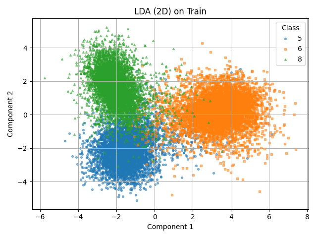
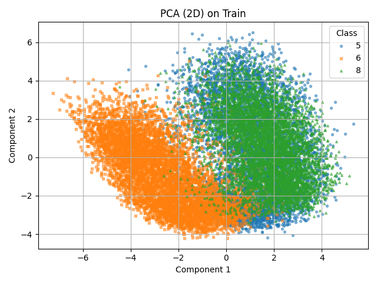

# Assignment 3 - Dimensionality Reduction

### Exercise 1 
- From the 10-class database, choose three classes (5, 6 and 8) and then reduce dimension to 2 using LDA

### Exercise 2
- Perform 3-class classification based on the generated 2-dimensional data.

### Dataset
- **Train:** `(17190, 784)` features, `(17190,)` labels  
- **Test:** `(2824, 784)` features, `(2824,)` labels  
- **Classes:** `[5, 6, 8]`

---

## LDA — 2D Gaussian Bayes  
**Test accuracy:** `0.9444`

**Confusion Matrix (rows = true, cols = predicted):**

| True \ Pred | 5   | 6   | 8   |
|-------------|-----|-----|-----|
| **5**       | 829 | 25  | 38  |
| **6**       | 23  | 928 | 7   |
| **8**       | 47  | 17  | 910 |

**Classification Report:**

| Class | Precision | Recall | F1-score | Support |
|-------|-----------|--------|----------|---------|
| 5     | 0.9221    | 0.9294 | 0.9257   | 892     |
| 6     | 0.9567    | 0.9687 | 0.9627   | 958     |
| 8     | 0.9529    | 0.9343 | 0.9435   | 974     |

**Averages:**
- Accuracy: **0.9444**  
- Macro avg: Precision `0.9439`, Recall `0.9441`, F1-score `0.9440`  
- Weighted avg: Precision `0.9445`, Recall `0.9444`, F1-score `0.9444`

---

### Optional Task
- (An additional optional (i.e. non-mandatory) exercise is to redo (2) using PCA instead, and then compare the results with the ones obtained using LDA.)

## PCA — 2D Gaussian Bayes  
**Test accuracy:** `0.7100`

**Confusion Matrix (rows = true, cols = predicted):**

| True \ Pred | 5   | 6   | 8   |
|-------------|-----|-----|-----|
| **5**       | 365 | 76  | 451 |
| **6**       | 58  | 897 | 3   |
| **8**       | 216 | 15  | 743 |

**Classification Report:**

| Class | Precision | Recall | F1-score | Support |
|-------|-----------|--------|----------|---------|
| 5     | 0.5712    | 0.4092 | 0.4768   | 892     |
| 6     | 0.9079    | 0.9363 | 0.9219   | 958     |
| 8     | 0.6207    | 0.7628 | 0.6845   | 974     |

**Averages:**
- Accuracy: **0.7100**  
- Macro avg: Precision `0.6999`, Recall `0.7028`, F1-score `0.6944`  
- Weighted avg: Precision `0.7025`, Recall `0.7100`, F1-score `0.6994`

---

## LDA vs PCA (Comparison)

| Method | Accuracy | Macro Precision | Macro Recall | Macro F1 |
|--------|----------|-----------------|--------------|----------|
| **LDA** | 0.9444   | 0.9439          | 0.9441       | 0.9440   |
| **PCA** | 0.7100   | 0.6999          | 0.7028       | 0.6944   |

**LDA significantly outperforms PCA** for this 3-class classification task.
