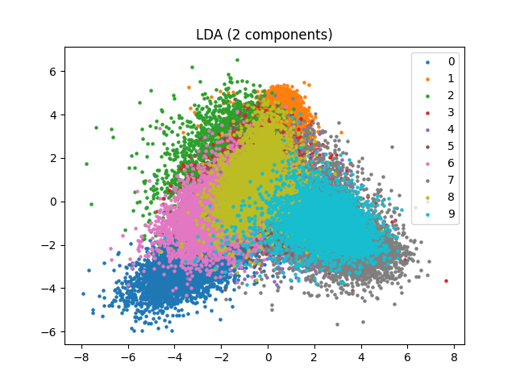
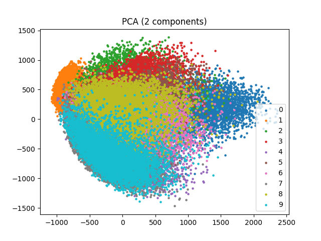
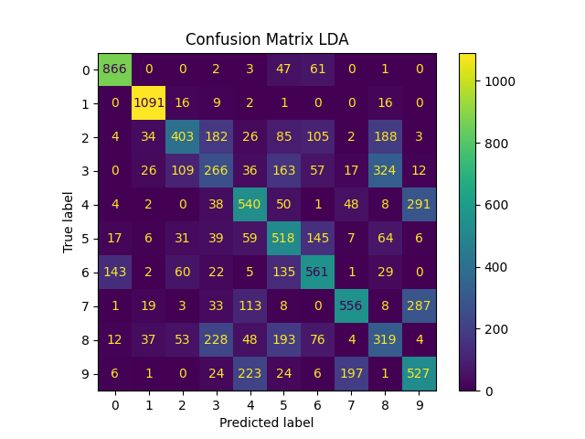
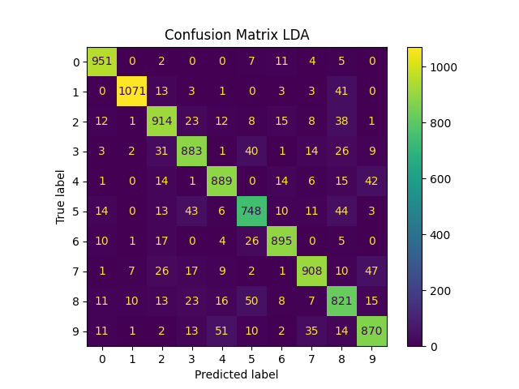
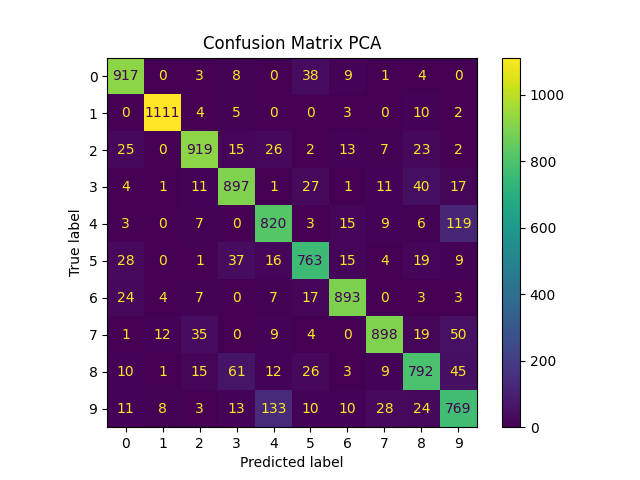

# Assignment 5 - Linear Discrimination

### Exercise
Perform classification for the entire MNIST dataset (the notebook uses the mnist_all.mat file attached to exercise 4) based on the algorithms introduced: Use LDA for dimensionality reduction to 2 or 9 dimensions, classify the dimension-reduced data and compare this classification performance with that of using PCA. 

### For 2 components
- Scatter Plots

- Confusion Matrix for 2 components

- Accuracy:
  - PCA accuracy: 0.465
  - LDA accuracy: 0.5647

### For 9 components

- Confusion Matrix for 2 components

- Accuracy:
  - PCA accuracy: 0.8779
  - LDA accuracy: 0.895